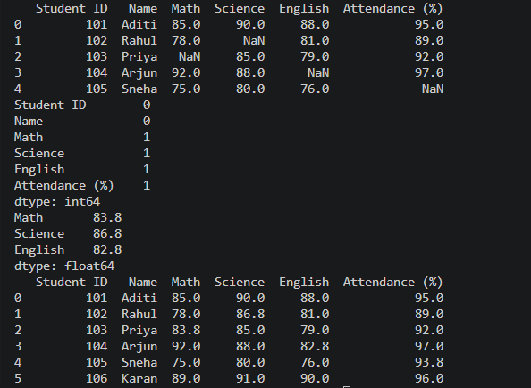
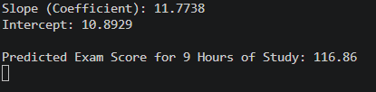
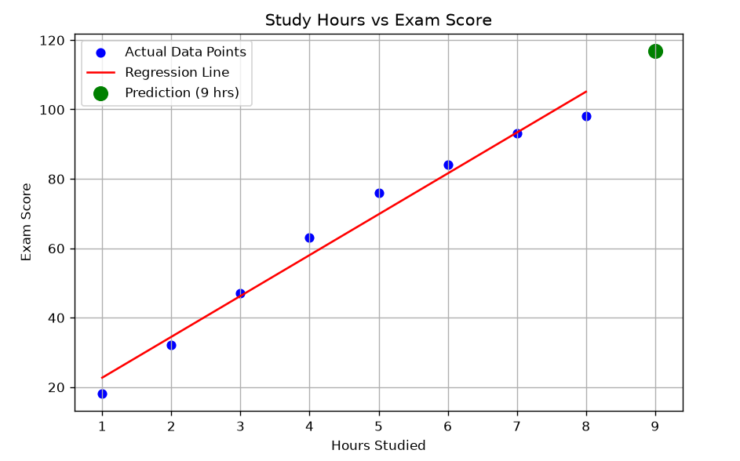
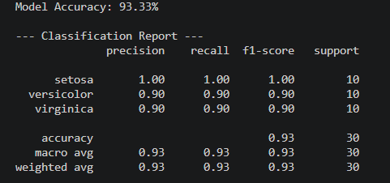

# GDG AI/ML Tasks

Python solutions for dataset processing, linear regression, and decision tree classification.

## Code Files
- task1_pandas.py
- task2_regression.py
- task3_classification.py

## Instructions
1. Install requirements:
   pip install pandas scikit-learn matplotlib
2. Run scripts:
   python task1_pandas.py
   python task2_regression.py
   python task3_classification.py

## Outputs

### Task 1 Output

### Task 2 Output

### Task 3 Output
